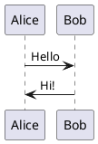
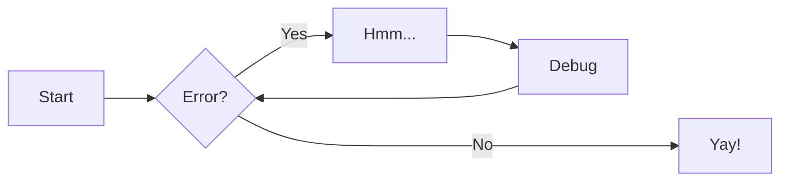

# Adding diagrams

We can add [PlantUML diagrams](https://plantuml.com) and [Mermaid diagrams](https://mermaid.js.org/intro)

Mermaid diagrams will also be shown on GitHub when a document is viewed there.

## PlantUML

PlantUML diagrams can be added bei either inlining it into the markdown file, or by adding a puml file.

### Inline PlantUML text

It is possible to write inline diagrams via Fenced Code Blocks.

The result will look like this



Just start the Mermaid block with a `plantuml` fenced block.

### Include PlantUML files

Place a `.puml` file in the `diagrams/src` folder. It's OK to create sub folders.
An example input file can be found in `diagram/src/example/somestate.puml`

This file will generate a corresponding output file, which can be included like this

```text

```

This will render the file whenever the documentation is built, and show the result


This option can be useful for lager or complex diagrams.


## Mermaid

Mermaid diagrams are always inline.

Just start the Mermaid block with a `mermaid` fenced block.



The diagram will be rendered just in place.

## Examples

Please have a look at the source for this page to view some examples.
